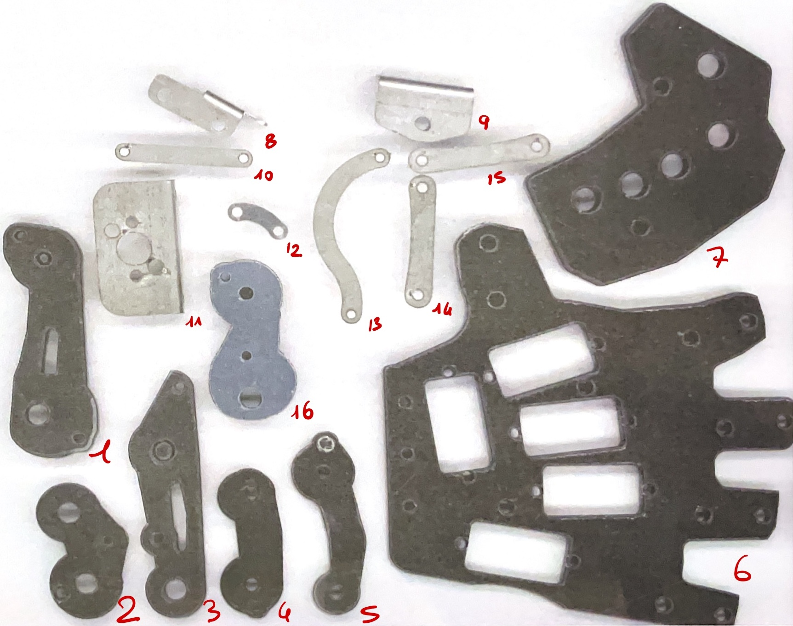

# Assignment1

## Description

This project concerns the assembly and structure of the model mdm02. The project is divided into main components, each of which is described in detail with explanatory images and references to the pieces used.

## Nomenclature

Picture with all component numered (each component has the relative number at the bottom right if possible).

The components follow the name `mdm02_<part>_<piece's number>`:

- `mdm`: Mechaninca Design;
- `02`: Group number;
- `<part>`: Subgrup of the hand:
  - `01`: Metacarpus;
  - `02`: Fingers;
  - `03`: Thumb;
  - `04`: Finger joints;
  - `05`: Thumb joints.
- `<piece's number>`: Identifier of the piece refered to the picture

<table style="undefined;table-layout: fixed; width: 645px"><colgroup>
<col style="width: 56px">
<col style="width: 28px">
<col style="width: 107px">
<col style="width: 133px">
<col style="width: 107px">
<col style="width: 107px">
<col style="width: 107px">
</colgroup>
<thead>
  <tr>
    <th colspan="2" rowspan="2">mdm02 </th>
    <th colspan="5">Parts</th>
  </tr>
  <tr>
    <th>Metacarpus _01</th>
    <th>Fingers _02</th>
    <th>Thumb _03</th>
    <th>Fingers joints _04</th>
    <th>Thumb joints _05</th>
  </tr>
</thead>
<tbody>
  <tr>
    <td class="tg-9wq8" rowspan="16">Pieces</td>
    <td class="tg-0pky">1</td>
    <td class="tg-0pky"></td>
    <td class="tg-0pky">mdm02_02_01</td>
    <td class="tg-0pky"></td>
    <td class="tg-0pky"></td>
    <td class="tg-0pky"></td>
  </tr>
  <tr>
    <td class="tg-0pky">2</td>
    <td class="tg-0pky"></td>
    <td class="tg-0pky"></td>
    <td class="tg-0pky">mdm02_03_02</td>
    <td class="tg-0pky"></td>
    <td class="tg-0pky"></td>
  </tr>
  <tr>
    <td class="tg-0pky">3</td>
    <td class="tg-0pky"></td>
    <td class="tg-c3ow">mdm02_02_03</td>
    <td class="tg-0pky"></td>
    <td class="tg-0pky"></td>
    <td class="tg-0pky"></td>
  </tr>
  <tr>
    <td class="tg-0pky">4</td>
    <td class="tg-0pky"></td>
    <td class="tg-0pky"></td>
    <td class="tg-0pky">mdm02_03_04</td>
    <td class="tg-0pky"></td>
    <td class="tg-0pky"></td>
  </tr>
  <tr>
    <td class="tg-0pky">5</td>
    <td class="tg-0pky"></td>
    <td class="tg-0pky">mdm02_02_05</td>
    <td class="tg-0pky"></td>
    <td class="tg-0pky"></td>
    <td class="tg-0pky"></td>
  </tr>
  <tr>
    <td class="tg-0pky">6</td>
    <td class="tg-c3ow">mdm02_01_06</td>
    <td class="tg-c3ow"></td>
    <td class="tg-c3ow"></td>
    <td class="tg-c3ow"></td>
    <td class="tg-c3ow"></td>
  </tr>
  <tr>
    <td class="tg-0pky">7</td>
    <td class="tg-c3ow">mdm02_01_07</td>
    <td class="tg-c3ow"></td>
    <td class="tg-c3ow"></td>
    <td class="tg-c3ow"></td>
    <td class="tg-c3ow"></td>
  </tr>
  <tr>
    <td class="tg-0pky">8</td>
    <td class="tg-0pky"></td>
    <td class="tg-0pky">mdm02_02_08</td>
    <td class="tg-0pky">mdm02_03_08</td>
    <td class="tg-0pky"></td>
    <td class="tg-0pky"></td>
  </tr>
  <tr>
    <td class="tg-0pky">9</td>
    <td class="tg-0pky"></td>
    <td class="tg-0pky">mdm02_02_09</td>
    <td class="tg-0pky">mdm02_02_09</td>
    <td class="tg-0pky"></td>
    <td class="tg-0pky"></td>
  </tr>
  <tr>
    <td class="tg-0pky">10</td>
    <td class="tg-0pky"></td>
    <td class="tg-0pky">mdm02_02_10</td>
    <td class="tg-0pky"></td>
    <td class="tg-0pky"></td>
    <td class="tg-0pky"></td>
  </tr>
  <tr>
    <td class="tg-0pky">11</td>
    <td class="tg-c3ow">mdm02_01_11</td>
    <td class="tg-0pky"></td>
    <td class="tg-0pky"></td>
    <td class="tg-0pky"></td>
    <td class="tg-0pky"></td>
  </tr>
  <tr>
    <td class="tg-0pky">12</td>
    <td class="tg-0pky"></td>
    <td class="tg-0pky"></td>
    <td class="tg-0pky">mdm02_03_12</td>
    <td class="tg-0pky"></td>
    <td class="tg-0pky"></td>
  </tr>
  <tr>
    <td class="tg-0pky">13</td>
    <td class="tg-0pky"></td>
    <td class="tg-0pky"></td>
    <td class="tg-0pky">mdm02_03_13</td>
    <td class="tg-0pky"></td>
    <td class="tg-0pky"></td>
  </tr>
  <tr>
    <td class="tg-0pky">14</td>
    <td class="tg-0pky"></td>
    <td class="tg-0pky">mdm02_02_14</td>
    <td class="tg-0pky"></td>
    <td class="tg-0pky"></td>
    <td class="tg-c3ow"></td>
  </tr>
  <tr>
    <td class="tg-0pky">15</td>
    <td class="tg-0pky"></td>
    <td class="tg-0pky">mdm02_02_14 (same as piece 14)</td>
    <td class="tg-0pky"></td>
    <td class="tg-0pky"></td>
    <td class="tg-0pky"></td>
  </tr>
  <tr>
    <td class="tg-0pky">16</td>
    <td class="tg-0pky"></td>
    <td class="tg-0pky"></td>
    <td class="tg-0pky">mdm02_03_16</td>
    <td class="tg-0pky"></td>
    <td class="tg-0pky"></td>
  </tr>
  <thead>
  <tr>
    <th colspan="2">mdm02 </th>
    <th colspan="5">Assemblies</th>
  </tr>
  <tr>
    <td colspan="2">Total _00</td>
    <td>Metacarpus _01</td>
    <td>Fingers _02</td>
    <td>Thumb _03</td>
    <td>Fingers joints _04</td>
    <td>Thumb joints _05</td>
  </tr>
  </thead>
  <tr>
    <td colspan="2">mdm02_00</td>
    <td>mdm02_01</td>
    <td>mdm02_02</td>
    <td>mdm02_03</td>
    <td>mdm02_04</td>
    <td>mdm02_05</td>
  </tr>
  <tr>
    <td colspan="2"></td>
    <td> </td>
    <td>   </td>
    <td>  </td>
    <td></td>
    <td></td>
  </tr>
</tbody>
</table>
